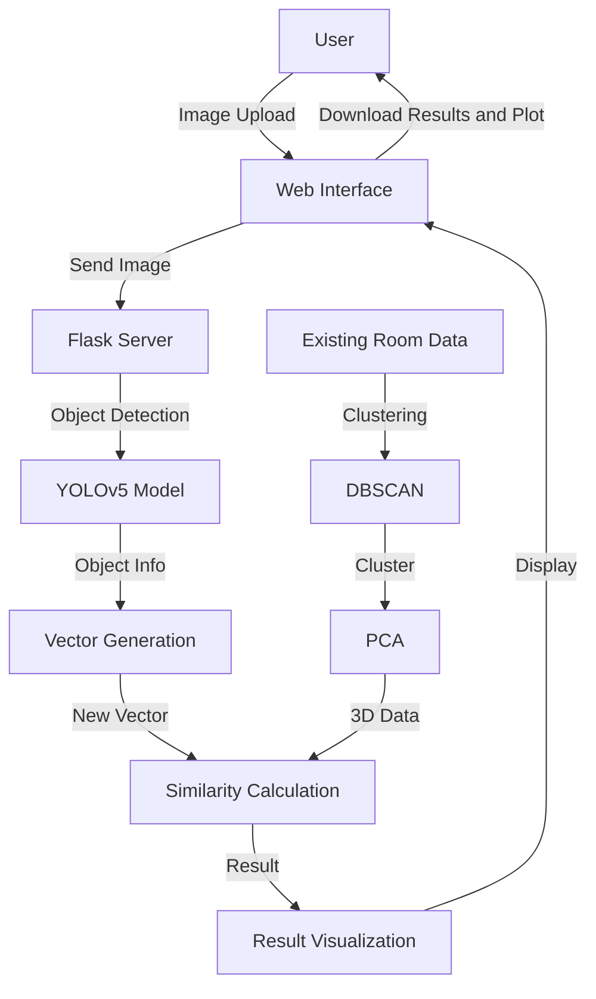

<div align="center">

# Room Classifier

🏠 Indoor Space Type Classification System Based on Images


</div>

## Overview

[![ko][icon-ko]][ko] [![en][icon-en]][en] 

[ko]: ./README.md
[icon-ko]: https://img.shields.io/badge/lang-ko-blue?style=flat-square
[en]: ./README.en.md
[icon-en]: https://img.shields.io/badge/lang-en-red?style=flat-square

Room Classifier is a web-based application that automatically identifies indoor space types through image analysis. This project combines YOLOv5 object detection technology, DBSCAN clustering analysis, and Manhattan distance-based similarity measurement techniques to precisely analyze the configuration of objects within a space.

This system is the real implementation of the undergraduate thesis "Object-based Clustering Analysis Method for Identifying Types of Configured Spaces," submitted to the 2023 Korea Software Congress (KSC 2023). The goal of this research is to overcome the limitations of existing interior design applications and support user space design through more accurate identification of space types.

## Features

- 🖼️ **Simple Image Upload**: Easily upload indoor space images through the web interface.
- 🔍 **Advanced Image Analysis**: Accurately detect objects in images using the YOLOv5 model.
- 🧮 **Sophisticated Data Processing**: Effectively process complex spatial data by applying DBSCAN clustering and PCA.
- 📊 **Intuitive Result Visualization**: Display analysis results clearly with a 3D PCA plot.
- 💾 **Download Results**: Conveniently download analysis results and visualizations.
- 🔄 **Continuous Analysis Support**: Provides a user-friendly interface for analyzing multiple images in succession.

## Structure

### Tech Stack

- **Backend**: Python, Flask
- **Frontend**: HTML, JavaScript
- **Machine Learning**: PyTorch (YOLOv5), Scikit-learn
- **Data Processing**: Pandas, NumPy
- **Visualization**: Matplotlib

### Workflow

1. **Image Upload**: The user uploads a room image through the web interface.
2. **Object Detection**: The YOLOv5 model detects objects in the uploaded image.
3. **Vector Generation**: A fixed-length vector is generated based on the detected objects and their confidence scores.
4. **Clustering and PCA**: DBSCAN clustering is applied to the pre-existing room data, and PCA is used to reduce the dimensions to three.
5. **Similarity Calculation**: The similarity between the new image vector and the existing clusters is calculated.
6. **Result Visualization**: The calculated similarity and 3D PCA plot are displayed on the web interface.
7. **Result Download**: The user can download both the analysis results and the 3D plot.

### Workflow Diagram



## Installation

### Method 1: Running Locally

1. **Clone the repository**
   ```bash
   git clone https://github.com/your-repo/room-classifier.git
   cd room-classifier
   ```

2. **Create and activate a virtual environment (optional but recommended)**
   ```bash
   python -m venv venv
   source venv/bin/activate  # Linux or macOS
   # or
   venv\Scripts\activate  # Windows
   ```

3. **Install Python dependencies**
   ```bash
   pip install -r requirements.txt
   ```

4. **Run the server**
   ```bash
   python app.py
   ```

## How to Use

1. Open a web browser and go to `http://127.0.0.1:5000`.
2. Click the 'Upload Image' button and select the indoor space image you want to analyze. The image will be processed automatically upon selection.
4. On the results page, check the predicted room type, similarity score table, and 3D PCA plot.
5. If needed, click 'Download Results' or 'Download Plot' to save the analysis results.

## Additional Information

<details open>
<summary><b>Recognition Rate</b></summary>

The table below shows the recognition accuracy for each room type:

<table>
  <tr>
    <th align="center">Livingroom</th>
    <th align="center">Kitchen</th>
    <th align="center">Library</th>
    <th align="center">Bedroom</th>
    <th align="center">Bathroom</th>
    <th align="center">Average</th>
  </tr>
  <tr align="center">
    <td>96.77%</td>
    <td>93.10%</td>
    <td>67.86%</td>
    <td>70.00%</td>
    <td>92.86%</td>
    <td><b>84.12%</b></td>
  </tr>
</table>

</details>

<details> <summary><b>Sample Data</b></summary>
Images were collected from Google using web crawling. The collected images were classified into five categories: living room, kitchen, library, bedroom, and bathroom. A total of 1,362 images were used to build the model, with 320 images of living rooms, 282 of kitchens, 175 of libraries, 315 of bedrooms, and 270 of bathrooms. The analyzed data can be found in the cvsdata folder.

</details>

<details>
<summary><b>Heatmap Information</b></summary>

A heatmap visualizing the distribution and patterns of the data used in the analysis is provided. For more details, refer to the `docs/heatmap.md` document.

📘 [heatmap.md](docs/heatmap.md)

</details> 
