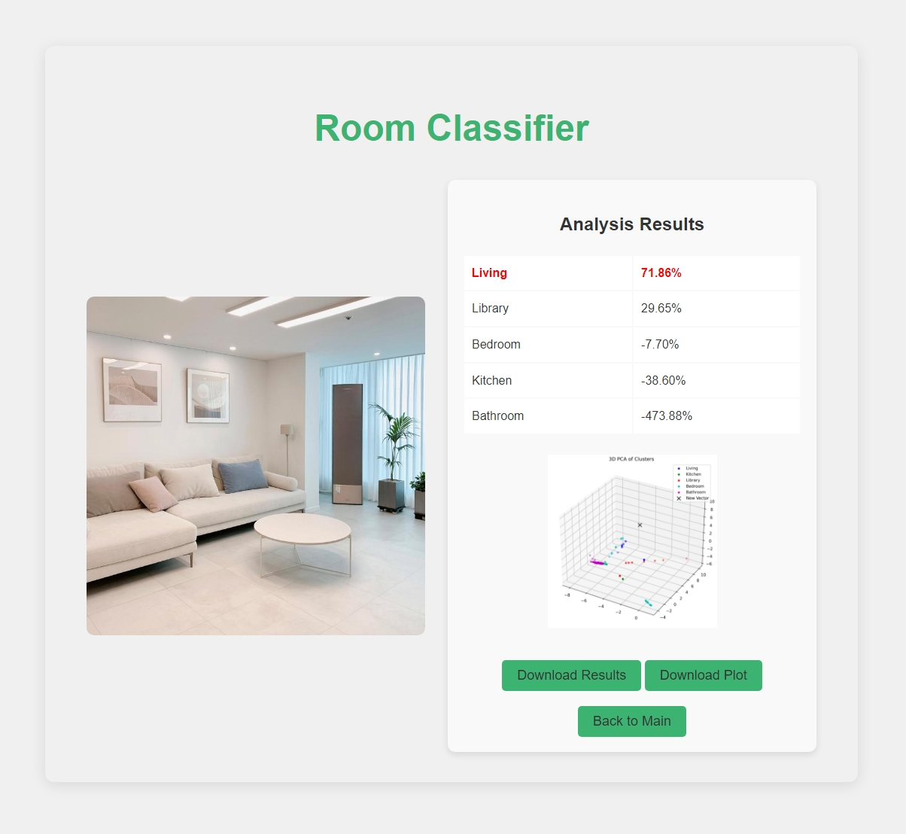
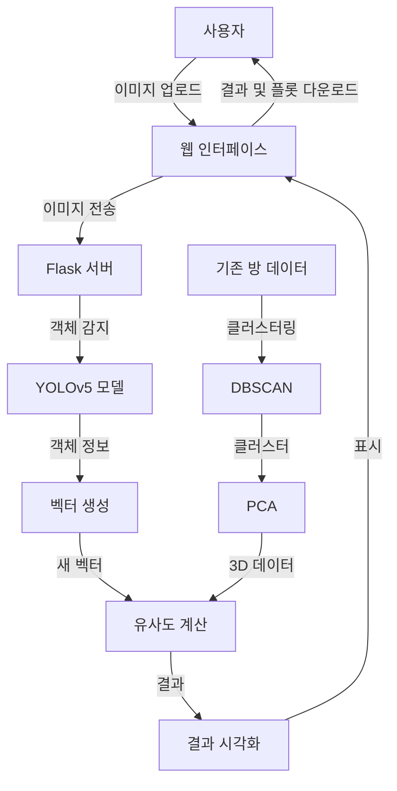

<div align="center">

# Room Classifier

🏠 이미지 기반 실내 공간 유형 분류 시스템



</div>


## 개요

[![ko][icon-ko]][ko] [![en][icon-en]][en] 

[ko]: ./README.md
[icon-ko]: https://img.shields.io/badge/lang-ko-blue?style=flat-square
[en]: ./README.en.md
[icon-en]: https://img.shields.io/badge/lang-en-red?style=flat-square

Room Classifier는 이미지 분석을 통해 실내 공간의 유형을 자동으로 식별하는 웹 기반 애플리케이션입니다. 이 프로젝트는 YOLOv5 객체 탐지 기술, DBSCAN 군집 분석, 그리고 맨해튼 거리 기반 유사도 측정 기법을 결합하여 공간 내 객체 구성을 정밀하게 분석합니다.

본 시스템은 2023년 한국소프트웨어종합학술대회(KSC 2023)에 제출된 학부생 논문 "구성 공간의 유형 식별을 위한 객체 기반의 군집 분석 방법"의 실제 구현체입니다. 이 연구는 기존 인테리어 애플리케이션의 한계를 극복하고, 보다 정확한 공간 유형 식별을 통해 사용자의 공간 설계를 지원하는 것을 목표로 합니다.

## 기능

- 🖼️ **간편한 이미지 업로드**: 웹 인터페이스를 통해 손쉽게 실내 공간 이미지를 업로드할 수 있습니다.
- 🔍 **고급 이미지 분석**: YOLOv5 모델을 사용하여 이미지 내 객체를 정확하게 감지합니다.
- 🧮 **정교한 데이터 처리**: DBSCAN 클러스터링과 PCA를 적용하여 복잡한 공간 데이터를 효과적으로 처리합니다.
- 📊 **직관적인 결과 시각화**: 분석 결과를 3D PCA 플롯과 함께 명확하게 표시합니다.
- 💾 **결과 다운로드**: 분석 결과와 시각화 자료를 편리하게 다운로드할 수 있습니다.
- 🔄 **연속 분석 지원**: 여러 이미지를 연속적으로 분석할 수 있는 사용자 친화적 인터페이스를 제공합니다.

## 구조

### 기술 스택

- **백엔드**: Python, Flask
- **프론트엔드**: HTML, JavaScript
- **머신러닝**: PyTorch (YOLOv5), Scikit-learn
- **데이터 처리**: Pandas, NumPy
- **시각화**: Matplotlib

### 작동 구조

1. **이미지 업로드**: 사용자가 웹 인터페이스를 통해 방 이미지를 업로드합니다.

2. **객체 감지**: YOLOv5 모델을 사용하여 업로드된 이미지에서 객체를 감지합니다.

3. **벡터 생성**: 감지된 객체와 그 신뢰도 점수를 바탕으로 고정 길이의 벡터를 생성합니다.

4. **클러스터링 및 PCA**: 미리 준비된 방 데이터에 DBSCAN 클러스터링을 적용하고, PCA를 사용하여 3차원으로 차원을 축소합니다.

5. **유사도 계산**: 새로운 이미지 벡터와 기존 클러스터 간의 유사도를 계산합니다.

6. **결과 시각화**: 계산된 유사도와 3D PCA 플롯을 웹 인터페이스에 표시합니다.

7. **결과 다운로드**: 사용자는 분석 결과와 3D 플롯을 다운로드할 수 있습니다.

### 작동 구조 다이어그램



## 설치

### 로컬 환경

1. **리포지토리 클론**
   ```bash
   git clone https://github.com/your-repo/room-classifier.git
   cd room-classifier
   ```

2. **가상 환경 생성 및 활성화 (선택사항이지만 권장)**
   ```bash
   python -m venv venv
   source venv/bin/activate  # Linux 또는 macOS
   # 또는
   venv\Scripts\activate  # Windows
   ```

3. **Python 의존성 설치**
   ```bash
   pip install -r requirements.txt
   ```

4. **서버 실행**
   ```bash
   python app.py
   ```

## 사용 방법

1. 웹 브라우저에서 `http://127.0.0.1:5000`에 접속합니다.
2. 'Upload Image' 버튼을 클릭하여 분석하고자 하는 실내 공간 이미지를 선택합니다. 선택시 자동으로 이미지를 처리합니다.
4. 결과 화면에서 예측된 방의 유형, 유사도 점수표, 3D PCA 플롯을 확인합니다.
5. 필요한 경우 'Download Results' 또는 'Download Plot' 버튼을 클릭하여 분석 결과를 저장합니다.

## 추가 정보

<details open>
<summary><b>인식률 (Recognition Rate)</b></summary>

아래 표는 각 방 유형별 인식 정확도를 나타냅니다:

<table>
  <tr>
    <th align="center">거실<br>(Livingroom)</th>
    <th align="center">주방<br>(Kitchen)</th>
    <th align="center">서재<br>(Library)</th>
    <th align="center">침실<br>(Bedroom)</th>
    <th align="center">욕실<br>(Bathroom)</th>
    <th align="center">평균<br>(Average)</th>
  </tr>
  <tr align="center">
    <td>96.77%</td>
    <td>93.10%</td>
    <td>67.86%</td>
    <td>70.00%</td>
    <td>92.86%</td>
    <td><b>84.12%</b></td>
  </tr>
</table>

</details>

<details>
<summary><b>샘플 자료</b></summary>

웹 크롤링을 활용하여 Google에서 이미지를 수집했습니다. 수집된 이미지는 거실, 주방, 서재, 침실, 화장실의 5가지로 분류되었으며, 총 1,362장의 이미지가 모델 제작에 활용되었습니다. 카테고리별 이미지 수는 거실 320장, 주방 282장, 서재 175장, 침실 315장, 화장실 270장입니다. 분석된 자료는 `cvsdata` 폴더에서 확인할 수 있습니다.
     
</details>

<details>
<summary><b>히트맵 (Heatmap) 정보</b></summary>

분석에 사용된 데이터의 분포와 패턴을 시각화한 히트맵을 제공합니다. 자세한 내용은 `docs/heatmap.md` 문서를 참조하세요.

📘 [heatmap.md](./docs/heatmap.md)
    
</details>
