<div align="center">

# Room Classifier

🏠 이미지 기반 실내 공간 유형 분류 시스템

</div>


## 개요

Room Classifier는 이미지 분석을 통해 실내 공간의 유형을 자동으로 식별하는 웹 기반 애플리케이션입니다. 이 프로젝트는 YOLOv5 객체 탐지 기술, DBSCAN 군집 분석, 그리고 맨해튼 거리 기반 유사도 측정 기법을 결합하여 공간 내 객체 구성을 정밀하게 분석합니다.

본 시스템은 2023년 한국소프트웨어종합학술대회(KSC 2023)에 제출된 학부생 논문 "구성 공간의 유형 식별을 위한 객체 기반의 군집 분석 방법"의 실제 구현체입니다. 이 연구는 기존 인테리어 애플리케이션의 한계를 극복하고, 보다 정확한 공간 유형 식별을 통해 사용자의 공간 설계를 지원하는 것을 목표로 합니다.

📘 [English README](:링크를 여기에 삽입하세요)


## 기능

- 🖼️ **간편한 이미지 업로드**: 웹 인터페이스를 통해 손쉽게 실내 공간 이미지를 업로드할 수 있습니다.
- 🔍 **고급 이미지 분석**: YOLOv5 모델을 사용하여 이미지 내 객체를 정확하게 감지합니다.
- 🧮 **정교한 데이터 처리**: DBSCAN 클러스터링과 PCA를 적용하여 복잡한 공간 데이터를 효과적으로 처리합니다.
- 📊 **직관적인 결과 시각화**: 분석 결과를 3D PCA 플롯과 함께 명확하게 표시합니다.
- 💾 **결과 다운로드**: 분석 결과와 시각화 자료를 편리하게 다운로드할 수 있습니다.
- 🔄 **연속 분석 지원**: 여러 이미지를 연속적으로 분석할 수 있는 사용자 친화적 인터페이스를 제공합니다.


## 구조

### 기술 스택

- **백엔드**: Python, Flask
- **프론트엔드**: HTML, JavaScript
- **머신러닝**: PyTorch (YOLOv5), Scikit-learn
- **데이터 처리**: Pandas, NumPy
- **시각화**: Matplotlib

### 작동 구조

1. **이미지 업로드**: 사용자가 웹 인터페이스를 통해 방 이미지를 업로드합니다.

2. **객체 감지**: YOLOv5 모델을 사용하여 업로드된 이미지에서 객체를 감지합니다.

3. **벡터 생성**: 감지된 객체와 그 신뢰도 점수를 바탕으로 고정 길이의 벡터를 생성합니다.

4. **클러스터링 및 PCA**: 미리 준비된 방 데이터에 DBSCAN 클러스터링을 적용하고, PCA를 사용하여 3차원으로 차원을 축소합니다.

5. **유사도 계산**: 새로운 이미지 벡터와 기존 클러스터 간의 유사도를 계산합니다.

6. **결과 시각화**: 계산된 유사도와 3D PCA 플롯을 웹 인터페이스에 표시합니다.

7. **결과 다운로드**: 사용자는 분석 결과와 3D 플롯을 다운로드할 수 있습니다.

### 작동 구조 다이어그램

```mermaid
graph TD
    A[사용자] -->|이미지 업로드| B[웹 인터페이스]
    B -->|이미지 전송| C[Flask 서버]
    C -->|객체 감지| D[YOLOv5 모델]
    D -->|객체 정보| E[벡터 생성]
    E -->|새 벡터| F[유사도 계산]
    G[기존 방 데이터] -->|클러스터링| H[DBSCAN]
    H -->|클러스터| I[PCA]
    I -->|3D 데이터| F
    F -->|결과| J[결과 시각화]
    J -->|표시| B
    B -->|결과 및 플롯 다운로드| A
```




## 설치

1. **리포지토리 클론**

   ```bash
   git clone https://github.com/your-repo/room-classifier.git
   cd room-classifier
   ```

2. **Python 의존성 설치**

   ```bash
   pip install -r requirements.txt
   ```

3. **서버 실행**

   ```bash
   python app.py
   ```

서버가 `http://127.0.0.1:5000`에서 실행됩니다.


## 사용

직관적인 웹 형식에 사진을 첨부하기만 하면 끝입니다!


## 기타

<details open>
  <summary>Recognition Rate</summary>
  <table border="1" table-layout="fixed">
  	<th align="center">Livingroom</th>
  	<th align="center">Kitchen</th>
    <th align="center">Library</th>
  	<th align="center">Bedroom</th>
    <th align="center">Bathroom</th>
  	<th align="center">Average</th>
  	<tr align="center"><!-- 첫번째 줄 시작 -->
      <td>96.77%</td>
      <td>93.10%</td>
      <td>67.86%</td>
      <td>70.00%</td>
      <td>92.86%</td>
      <td>
        <span style="color:red">84.12%</span>
      </td>
  	</tr><!-- 첫번째 줄 끝 -->
  </table>
</details>

<details close>
  <summary>Heatmap</summary>
  분석에 사용된 자료를 볼 수 있습니다. heatmap 문서를 확인하세요.
</details>
