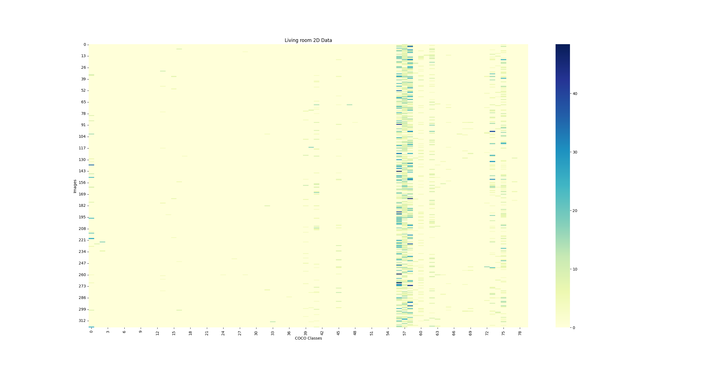
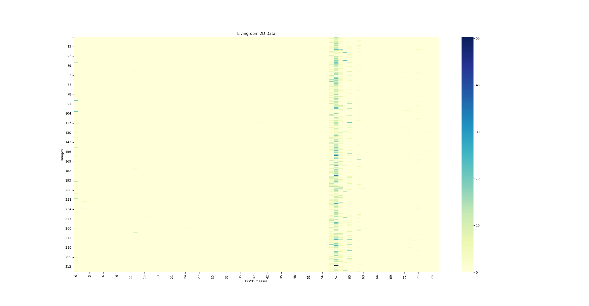
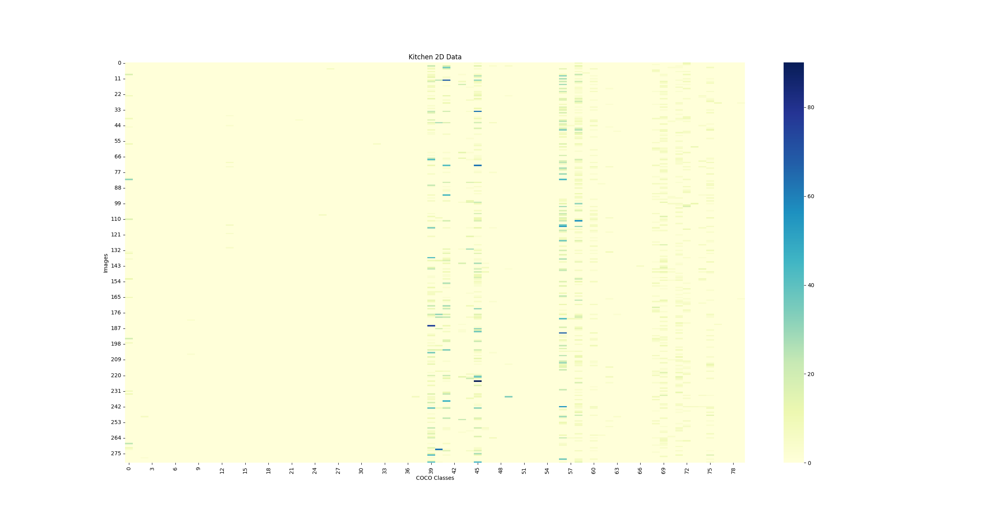
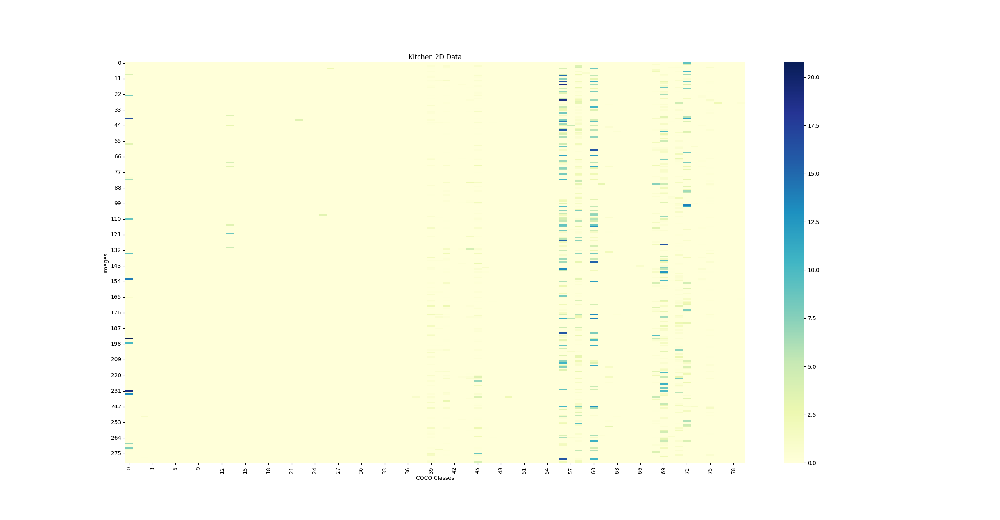
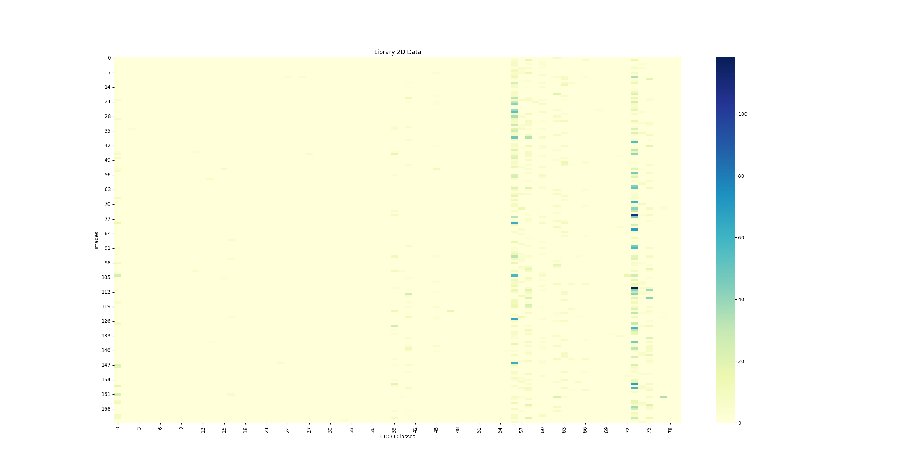
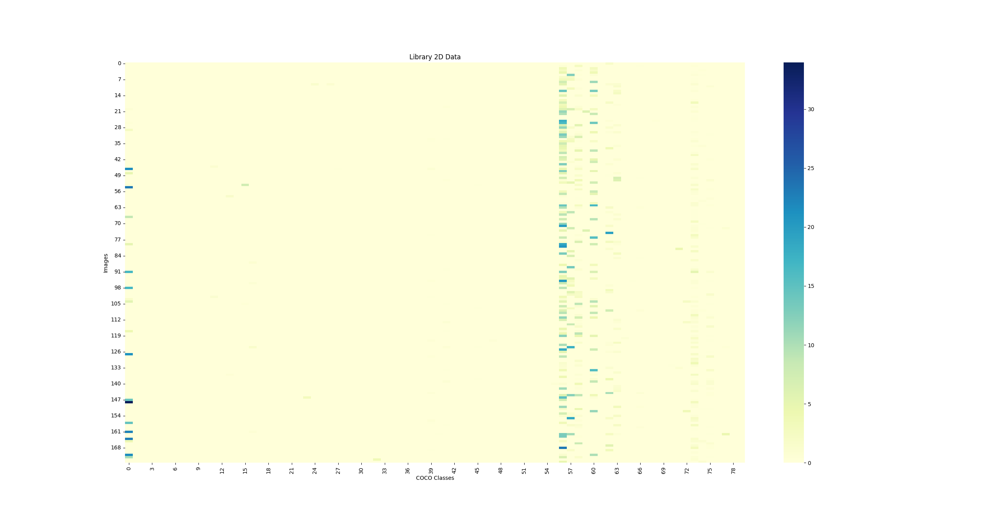
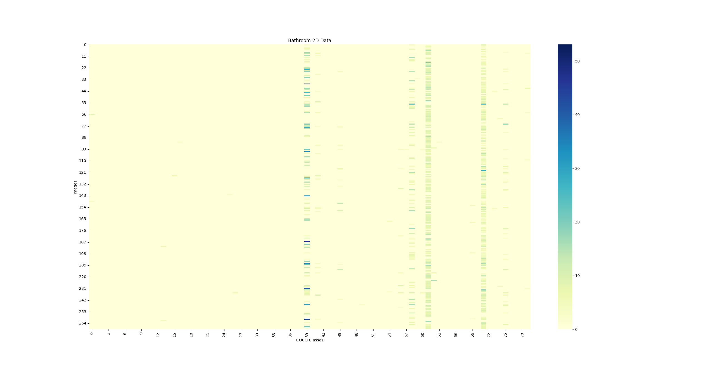

# 히트맵 분석

본 문서에서는 구글 웹 크롤링을 통해 수집한 실내 공간 이미지 샘플들이 coco class에 따라 어떻게 분포되어 있는지를 시각적으로 보여주는 히트맵 자료를 설명합니다. 이 자료는 거실, 주방, 서재, 침실, 화장실의 5가지 공간 유형으로 나누어 분석되었습니다. 각 히트맵은 해당 공간 내에서 발견된 객체들의 분포를 명확하게 보여줍니다.

각 공간 유형마다 두 개의 히트맵을 제공합니다:

1. 첫 번째 히트맵은 `score x (객체의 크기 / 이미지의 크기) × 100 × 객체 수` 공식을 이용하여 생성된 결과입니다.
2. 두 번째 히트맵은 **이 프로그램에서 실제로 사용된 자료로**, `score × 10 × 객체 수` 값을 기반으로 작성되었습니다. 두 번째 히트맵이 프로그램의 분석에 핵심적인 역할을 합니다.

## 히트맵 파일 목록

### 1. 거실 히트맵

- 첫 번째 히트맵: `score x (객체의 크기 / 이미지의 크기) × 100 × 객체 수`
  
  
  
- 두 번째 히트맵 (사용된 값): `score × 10 × 객체 수`

  

### 2. 주방 히트맵

- 첫 번째 히트맵: `score x (객체의 크기 / 이미지의 크기) × 100 × 객체 수`
  
  
  
- 두 번째 히트맵 (사용된 값): `score × 10 × 객체 수`

  

### 3. 서재 히트맵

- 첫 번째 히트맵: `score x (객체의 크기 / 이미지의 크기) × 100 × 객체 수`
  
  
  
- 두 번째 히트맵 (사용된 값): `score × 10 × 객체 수`

  

### 4. 침실 히트맵

- 첫 번째 히트맵: `score x (객체의 크기 / 이미지의 크기) × 100 × 객체 수`
  
  
  
- 두 번째 히트맵 (사용된 값): `score × 10 × 객체 수`

  

### 5. 화장실 히트맵

- 첫 번째 히트맵: `score x (객체의 크기 / 이미지의 크기) × 100 × 객체 수`
  
  
  
- 두 번째 히트맵 (사용된 값): `score × 10 × 객체 수`

  
